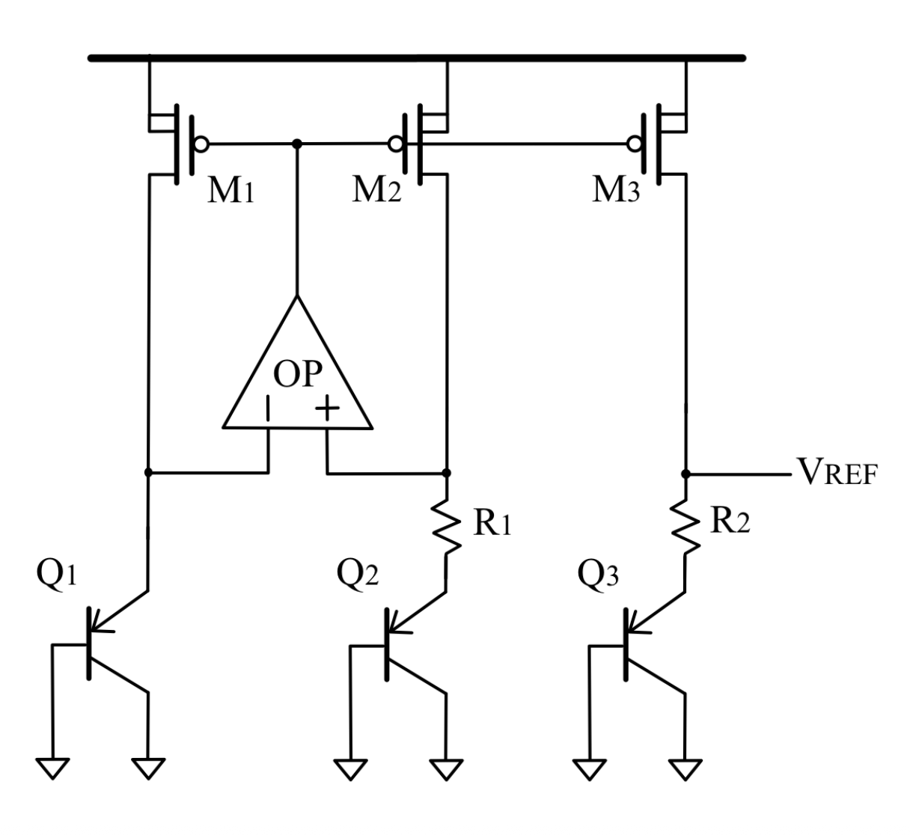

## Design Objective

The goal of this project is to design a **precision bandgap reference** operating at **1.8V～2.0V** with the following objectives:

- Generate a stable reference voltage around **1.2V**
- Achieve low temperature coefficient across wide temperature range
- Optimize static current consumption as low as possible

---

## Architecture Overview

- **CTAT voltage generator** based on diode-connected bipolar devices
- **PTAT voltage generator** using ΔVBE from emitter-area ratio
- **Resistive weighting network** for PTAT–CTAT summation
- **Operational amplifier** enforcing accurate node voltage equality
- **Bias and current mirror network** for reference current generation
- **Startup mechanism** ensuring correct power-up behavior

---

## Bandgap Operating Principle

The reference voltage is formed by summing a CTAT voltage and a PTAT voltage:

$$
V_{\text{REF}}= \frac{R_2}{R_1} V_T \ln(n) + V_{EB3}
$$

where:

- $$V_{EB3}$$ is the CTAT base–emitter voltage  
- $$V_T = \frac{kT}{q}$$ is the thermal voltage  
- n is the emitter-area ratio of bipolar devices  

To minimize temperature dependence, the resistor ratio is selected such that the PTAT and CTAT slopes cancel around the nominal operating temperature.  
In this design, an emitter-area ratio of ( n = 8 )  is chosen to balance layout symmetry and PTAT voltage magnitude.

---

## Supply & Operating Conditions

| Parameter | Value |
|---------|------|
| Technology | UMC 0.18µm CMOS |
| Supply Voltage (VDD) | 1.8V (sweep: 1.8–2.0V) |
| Reference Voltage @ 60°C | ~1.2V |
| Temperature Range | −40°C to 100°C |
| Process Corners | TT / FF / SS |

---

## Final Performance Summary at TT corner $$V_{DD}=1.8V$$

| Metric | Spec | Pre-Sim | Post-Sim |
|------|------|---------|----------|
| VREF @ 60°C | ~1.2V | 1.214V | 1.213V |
| Static Current (exclude OP) | < 50µA | 9.34µA | 9.32µA |
| OP Current | — | ~55.9 µA | ~55.69 µA |
| OP Power Dissipation | — | 100.62 µW | 100.64 µW |
| Temperature Coefficient | < 15 ppm/°C | 8.37ppm/°C | 10.08 ppm/°C |

Detailed pre-simulation and post-simulation results across TT/FF/SS corners and supply variations are documented in `analysis/bandgap_parameter_derivation.pdf`.

---

## Device Parameters

### Bipolar Devices
| Device | Type | Emitter Area Ratio |
|------|------|--------------------|
| $$Q_1 : Q_2 : Q_3$$ | PNP BJT | 1 : 8 : 1|

### MOS Devices
| Device | W / L (µm / µm) |
|------|------------------|
| $$M_1, M_2, M_3$$ | 8 / 1 |

### Passive Components
| Component | Value |
|----------|-------|
| $$R_1$$ | ~20 kΩ |
| $$R_2$$ | ~170 kΩ |

---

## Temperature Sweep Results

### VREF vs. Temperature (TT / FF / SS @ VDD = 1.8 V)

<table>
  <tr>
    <td align="center"><b>Pre-Simulation</b></td>
    <td align="center"><b>Post-Simulation</b></td>
  </tr>
  <tr>
    <td></td>
    <td></td>
  </tr>
</table>

---

## Supply Sensitivity

### VREF vs. Temperature under Different Supply Voltages

<table>
  <tr>
    <td align="center"><b>VDD = 1.8 / 1.9 / 2.0 V</b></td>
  </tr>
  <tr>
    <td></td>
  </tr>
</table>

---

## Transient Response

### VREF under VDD Ramp (1.8 V → 2.0 V, 100 ms rise time)

<table>
  <tr>
    <td align="center"><b>Pre-Simulation</b></td>
    <td align="center"><b>Post-Simulation</b></td>
  </tr>
  <tr>
    <td></td>
    <td></td>
  </tr>
</table>

---

## Layout Implementation

| Item | Result |
|----|----|
| Layout Area | ~8,100 µm² |
| DRC | Pass |
| LVS | Pass |
| Floorplan | Symmetric, matched devices |

<table>
  <tr>
    <td></td>
    <td></td>
  </tr>
</table>

---

## Design Methodology & Parameter Derivation

The analytical derivation of the bandgap equation, resistor ratio selection, emitter-area ratio choice, and operational amplifier design considerations are documented in:

📄 **`analysis/bandgap_parameter_derivation.pdf`**

This document includes:

- Step-by-step derivation of \( V_{REF} \)
- PTAT–CTAT slope matching strategy
- Initial hand calculations and assumptions
- Parameter refinement based on simulation feedback
- PVT robustness considerations

---

## Tools & Environment

- Cadence Virtuoso
- Spectre Simulator
- UMC 0.18 µm PDK
- Custom transistor-level netlists

---

## Author

**Yu-Hsiang Lin**  
Analog & Mixed-Signal IC Design  
National Yang Ming Chiao Tung University
